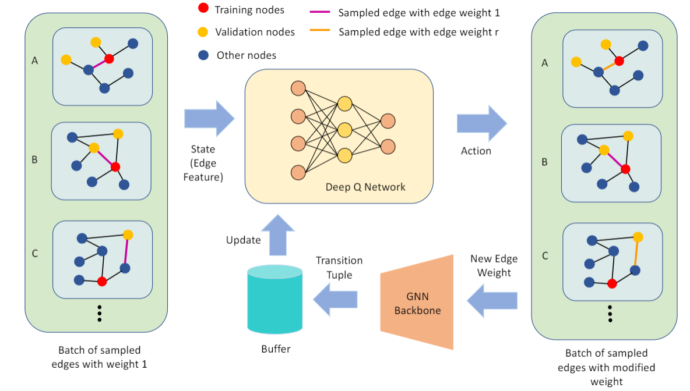
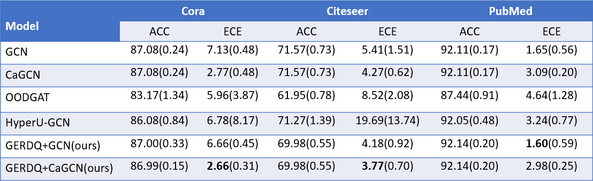
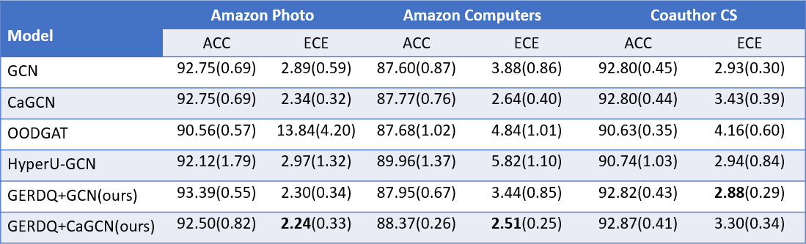

# Calibrate Graph Neural Networks under Out-of-Distribution

This is the source code for the CIKM paper "Calibrate Graph Neural Networks under Out-of-Distribution
Nodes via Deep Q-learning".



## Requirements
* pytorch  
* matplotlib  
* numpy  
* scipy

## Running the experiments
First, we run the `main.py` to obtain the the checkpoint of the Q network. The running commands for each dataset in illustrated in `run_sds.sh`. For instance, for cora dataset, we run
```
python main.py --dataset=cora  --total_epochs=400  --log log_cora.txt  --Q_training  --model_path cora_GCN --weight 0.4
```

The checkpoint will be save into `adj` folders. The pretrained checkpoints are provided in `adj_save`.

Next, we run `train.py` to train the GCN model with adjusted edge weights. The experiments are repeated 10 times.
```
seeds='40 41 42 43 44 45 46 47 48 49'
for seed in $seeds
do 
    python train.py --seed $seed  --dataset cora
done
```

## Results
The accuracy and expected calibration error of our model as well as the baselines are shown in the figures below. Both the average and the standard deviation are reported. The experimental setting is slightly different from what is described in the paper. Please refer to the tables as the main results.





## Cite
if you think our paper and code are useful, feel free to cite our paper.
```
@inproceedings{shi2023calibrate,
  title={Calibrate Graph Neural Networks under Out-of-Distribution Nodes via Deep Q-learning},
  author={Shi, Weili and Yang, Xueying and Zhao, Xujiang and Chen, Haifeng and Tao, Zhiqiang and Li, Sheng},
  booktitle={Proceedings of the 32nd ACM International Conference on Information and Knowledge Management},
  pages={2270--2279},
  year={2023}
}
```
